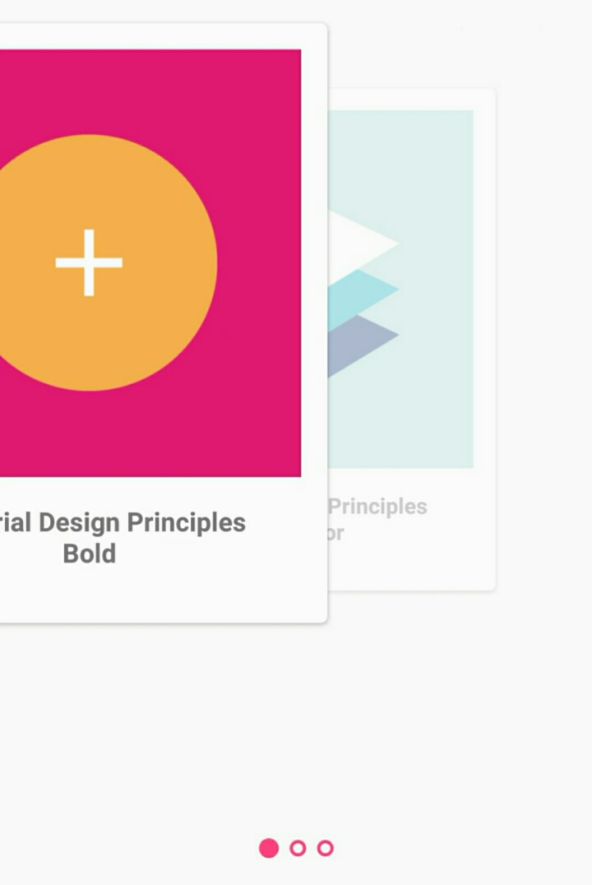

# Slider
Android library for sliding views with default indicator (dot) and view transitions.

Usage
-----
Import the library ('slider') from your project and

In app/gradle.build

```groovy
dependencies {
    implementation project(':slider')
}
```

minSdkVersion = '23'

Example
-------

First, You need to bind your items with SliderAdapter

public class YourSliderAdapter extends SliderAdapter<OBJ>
{
    public ImageSlider(Context context) {
        super(context);
    }

    public ImageSlider(Context context, ArrayList<OBJ> itemList) {
        super(context, itemList);
    }

    @Override
    public void onCreateView(ViewGroup container) {
        View view = createView(R.layout.view_header, container);
    }

    @Override
    public void onBindView(ViewGroup container, int position) {
        // bind your items here
    }
}


In MainActivity.java

    @Override
    protected void onCreate(Bundle savedInstanceState) {
        super.onCreate(savedInstanceState);
        setContentView(R.layout.activity_main);

        slider.setAdapter(new SliderAdapter());
        slider.setDotIndicator(DotIndicator.ALIGN_BOTTOM);
        slider.setPageTransformer(new DepthPageTransformer());
    }
    
In activity_main.xml

    <me.aungkooo.slider.Slider
        android:id="@+id/slider"
        android:layout_width="match_parent"
        android:layout_height="match_parent"/>

	  
Screenshot
----------
